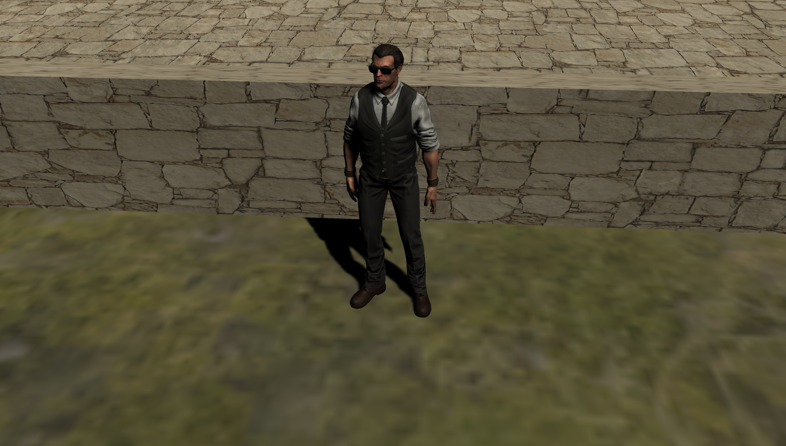
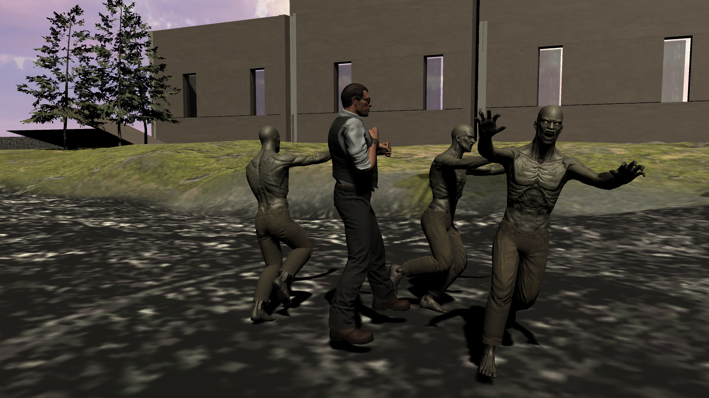
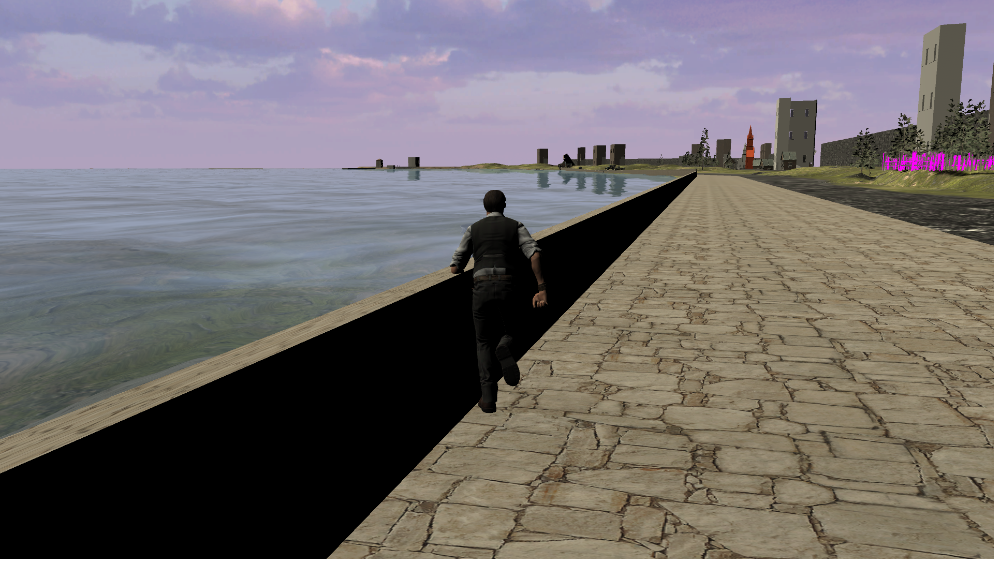

# Garitsa Zombie Apocalypse
## Αναφορά
## Φάμπιαν Χαίγκερ ,ΑΜ:2016187
### Περιγραφή
3d Person Action Game
Στόχος clear the zombies from Γαριτσα
gameplay : hand combat

Οι εχθροί βρίσκονται σε διάφορα σημεία του χάρτη και ξεκινούν να επιτείθενται στον παίκτη όταν εισέλθει σε καθορισμένες περιοχές.
Ο χρήστης πρέπει να τους αποφεύγει και να τους χτύπα είτε τρέχοντας είτε με το να σέρνεται μακριά.
Ο Χάρτης περιέχει συνδιασμό έτοιμων και μη asset και είναι αρκετά μεγάλος σε διάσταση.Παρόλο που τα κτήρια δεν είναι ακριβή αντίγραφα των πραγματικών
οι διαστάσεις και οι αποστάσεις μεταξύ των γνώστων σημείων στην περιοχή του παραλιακού είναι αρκετά ακριβείς.
Ο κώδικας δεν ήταν έτοιμος και έγινε με την αναζήτηση στο api της unity και την μελέτη άλλων προγραμμάτων με παρόμοιο στόχο.

- 

- 

- 
 
- 

- 

- 

 - 

- [ Watch Gameplay here](https://www.youtube.com/watch?v=sgApikWOG1o)
- [ Download executable](https://drive.google.com/file/d/1KjwZX5nUTi0Axppa31r51Ig8raorerqW/view?usp=sharing)
- [Presentation](https://github.com/fabianhoegger/Unity-game/blob/master/parousiasi_psifiakoys.odp)

### Πακέτα που χρησιμοποιήσα
1. [Cinemachine](https://unity.com/unity/features/editor/art-and-design/cinemachine) -Κάμερα
2. [BodyGuards](https://assetstore.unity.com/packages/3d/characters/humanoids/humans/bodyguards-31711) prefab
3. [Zombie](https://assetstore.unity.com/packages/3d/characters/humanoids/zombie-30232) Prefab
4. [ADG_Textures](https://assetstore.unity.com/packages/2d/textures-materials/brick/18-high-resolution-wall-textures-12567)
5. [Standard Asset](https://assetstore.unity.com/packages/essentials/asset-packs/standard-assets-for-unity-2018-4-32351) water prefab
6. [AllSky](https://assetstore.unity.com/packages/2d/textures-materials/sky/allsky-free-10-sky-skybox-set-146014) skybox
7. [Conifers](https://assetstore.unity.com/packages/3d/vegetation/trees/conifers-botd-142076) 
8. [Flooded Grounds](https://assetstore.unity.com/packages/3d/environments/flooded-grounds-48529)

### Τεχνικες Optimization
- Χαμηλο detail Density σε tiles που έχουν περισσότερο διακοσμητικό ρολο
- Χρήση Gpu Instancing Σε  Materials που χρησιμοποιούνται σε διαφορετικά αντικείμενα
- Έλεχγος της απόδοσης μέσω του Profiler
- Σημείωση των ακίνητων αντικειμένων ώς static με σκοπό να μπορεί να κάποιους υπολογισμούς η unity με μεγαλύτερη ευκολία
- Χρήση Απλών Shader επίσης για την μείωση του φόρτου στην διάρκεια του rendering
- Χρήση Baked Light η οποία είναι μια ρύθμιση που επιτρέπει να γίνουν κάποιοι υπολογισμοί σε σχέση με τον φωτισμό των αντικειμένων μόνο μια φορά αντί αυτό να γίνεται συνεχόμενα κατά
την διάρκεια του παιχνιδιού.Αυτό απαιτεί και την επισημανση των στατικών αντικειμένων ως static.
- μια άλλη βελτίωση του κώδικα ήταν όταν καλείται ενα αντικείμενο στον κώδικα αυτό να μην γίνεται με τη χρήση του getObjectwithTag αλλά με άλλους τρόπους καθώς είναι πιό χρονοβόρο.

### Κώδικας

> Για την κίνηση του χαρακτήρα χρησιμοποιείται το Move.cs και το Punched.cs το οποίο καλείται όταν γίνεται σύγκρουση μεταξύ των άκρων του χαρακτήρα και των εχθρών.
 Μέσα από αυτούς τους κώδικες αλλάζουν και τα animation σύμφωνα με τον παρακάτω animator
 
 
 
 >Για την κίνηση των εχθρών χρησιμοποιείται ο κώδικας BasicEnemy.cs και EnemyTerritory.cs.Το 2ο χρησιμοποιείται ώστε να ενεργοποιούνται οι έχθροι όταν ο παίκτης εισέλθει σε μια περιοχή.
  Ακομη Χρησιμοποιείται το Zpunch.cs οταν εχθρος χτυπά των παίκτη.
  
  ### Εργαλεία
   >Για την δημουργία του terrain χρησιμοποιήθηκε το εργαλείο της Unity συνδιάζοντας textures και meshes
   >Για την χρήση animation χρησιμοποιήθηκε animator και animation retargeting
   
   ### Χρήσιμες Ιστοσελίδες και Βίντεο
 - https://gamedevacademy.org/unity-animator-tutorial/
  - https://www.youtube.com/watch?v=vTBObJBXYQ4&ab_channel=HowToDo
  - https://www.youtube.com/watch?v=vTBObJBXYQ4&ab_channel=HowToDo
  - www.micamo.com
   
